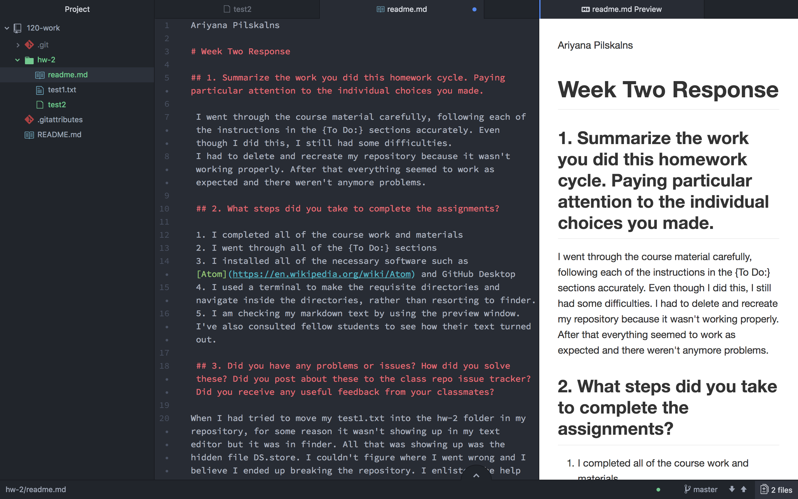

Ariyana Pilskalns

# Week Two Response

## 1. Summarize the work you did this homework cycle. Paying particular attention to the individual choices you made.

 I went through the course material carefully, following each of the instructions in the {To Do:} sections accurately. Even though I did this, I still had some difficulties.
 I had to delete and recreate my repository because it wasn't working properly. After that everything seemed to work as expected and there weren't anymore problems.

 ## 2. What steps did you take to complete the assignments?

 1. I completed all of the course work and materials
 2. I went through all of the {To Do:} sections
 3. I installed all of the necessary software such as [Atom](https://en.wikipedia.org/wiki/Atom) and GitHub Desktop
 4. I used a terminal to make the requisite directories and navigate inside the directories, rather than resorting to finder.
 5. I am checking my markdown text by using the preview window. I've also consulted fellow students to see how their text turned out.

 ## 3. Did you have any problems or issues? How did you solve these? Did you post about these to the class repo issue tracker? Did you receive any useful feedback from your classmates?

When I had tried to move my test1.txt into the hw-2 folder in my repository, for some reason it wasn't showing up in my text editor but it was in finder. All that was showing up was the hidden file DS.store. I couldn't figure where I went wrong and I believe I ended up breaking the repository. I enlisted the help of my dad who is quite skilled with computers and he suggested starting over. It didn't take me long to create a new repository and the problem didn't happen again. I used the terminal commadns:

 ```mkdir hw-2```

 ```cd hw-2```

 ```touch readme.md```

 to create my directory and md file.


## 4. Is there anything in particular you learned that you would like to discuss further?

1. I am curious about hidden files. What is the ds-store file?
2. I'd like to learn more about git repositories.
3. I would like to learn more terminal commands such as:


- pwd ~ print working directory
- touch ~ create
- mkdir ~ make directory
- cd ~ change directory
- mv ~ move
- ls ~ list

## 5. What issues did you help your fellow classmates out with this past homework cycle?

By the time I checked the issues section the questions my peers had seemed to have all been answered and their problems solved. I didn't have anything to contribute this week.

Here's a screen shot of my homework:



